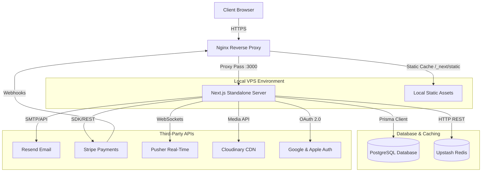

# 🍟 Crazy Chips — Server-Side Architecture & VPS Hosting Guide

This document provides a comprehensive overview of the server-side architecture and step-by-step instructions for hosting and deploying the **Crazy Chips** application on a **Hostinger VPS** (or any Ubuntu-based VPS) using Nginx, PM2, and SSL.

---

## 🏗️ Server-Side Architecture

The server-side stack is designed to be lightweight, fast, and scalable, utilizing modern serverless/managed services alongside a self-hosted Next.js standalone server.



### Key Components

1. **Next.js (Standalone Mode)**:
   - Configured in [next.config.ts](file:///t:/DAP%20Tech/CRAZY%20Chips/crazy-chips/next.config.ts) using `output: 'standalone'`.
   - Instead of shipping the entire `node_modules`, the build process extracts only the necessary files into `.next/standalone/server.js`, reducing the deployment size by up to 90%.
2. **Database (Prisma & PostgreSQL)**:
   - Uses [Prisma ORM](file:///t:/DAP%20Tech/CRAZY%20Chips/crazy-chips/prisma/schema.prisma) to model data.
   - Database migrations are applied during deployment via `npx prisma migrate deploy`.
3. **Caching (Upstash Redis)**:
   - Configured in [lib/redis.ts](file:///t:/DAP%20Tech/CRAZY%20Chips/crazy-chips/lib/redis.ts) for rate-limiting, session caching, or temporary key-value storage.
4. **Payments (Stripe)**:
   - Handled via the Stripe SDK [lib/stripe.ts](file:///t:/DAP%20Tech/CRAZY%20Chips/crazy-chips/lib/stripe.ts).
   - Payments are initiated via [app/api/create-payment-intent/route.ts](file:///t:/DAP%20Tech/CRAZY%20Chips/crazy-chips/app/api/create-payment-intent/route.ts).
   - Webhooks are routed through Nginx with buffering disabled to ensure reliable real-time event processing.
5. **Real-time (Pusher)**:
   - Provides instant notifications and updates (e.g., order status updates) to client browsers.

---

## 🌐 VPS Hosting & Setup Guide

### 1. Prerequisites (VPS Setup)

Log in to your VPS via SSH and install the required dependencies:

```bash
# Update system packages
sudo apt update && sudo apt upgrade -y

# Install Node.js (Node 20+ recommended)
curl -fsSL https://deb.nodesource.com/setup_20.x | sudo -E bash -
sudo apt-get install -y nodejs

# Install Git, Nginx, and PM2 globally
sudo apt-get install -y git nginx
sudo npm install -y -g pm2

# Install Certbot for SSL certificates
sudo apt install -y certbot python3-certbot-nginx
```

---

### 2. Project Directory Setup

We host the application in `/var/www/crazy-chips`. Set up the directory and clone the repository:

```bash
# Create directory and set permissions
sudo mkdir -p /var/www/crazy-chips
sudo chown -R $USER:$USER /var/www/crazy-chips

# Clone the repository
git clone https://github.com/yourusername/crazy-chips.git /var/www/crazy-chips
```

---

### 3. Environment Configuration

Create a `.env` file in the root of the project `/var/www/crazy-chips/.env`. You can use [.env.production.example](file:///t:/DAP%20Tech/CRAZY%20Chips/crazy-chips/.env.production.example) as a reference:

```bash
cp /var/www/crazy-chips/.env.production.example /var/www/crazy-chips/.env
nano /var/www/crazy-chips/.env
```

Ensure you fill in all the required secrets, including `DATABASE_URL`, `NEXTAUTH_SECRET`, `STRIPE_SECRET_KEY`, etc.

---

### 4. Nginx Configuration

Nginx acts as a reverse proxy, handling SSL termination, static file caching, and routing requests to the Next.js standalone server running on port `3000`.

Copy the [nginx.conf](file:///t:/DAP%20Tech/CRAZY%20Chips/crazy-chips/nginx.conf) to your Nginx sites-available directory:

```bash
sudo cp /var/www/crazy-chips/nginx.conf /etc/nginx/sites-available/crazy-chips

# Symlink to sites-enabled
sudo ln -s /etc/nginx/sites-available/crazy-chips /etc/nginx/sites-enabled/

# Remove the default nginx config if it's still active
sudo rm /etc/nginx/sites-enabled/default

# Test Nginx configuration and reload
sudo nginx -t
sudo systemctl reload nginx
```

#### SSL Setup (Certbot)
Run Certbot to automatically fetch and configure the SSL certificates:
```bash
sudo certbot --nginx -d yourdomain.com -d www.yourdomain.com
```

---

### 5. Deployment Workflow

Deployments are automated using the [deploy.sh](file:///t:/DAP%20Tech/CRAZY%20Chips/crazy-chips/deploy.sh) script. 

#### What [deploy.sh](file:///t:/DAP%20Tech/CRAZY%20Chips/crazy-chips/deploy.sh) does:
1. Pulls the latest code from `main`.
2. Installs production dependencies (`npm ci --omit=dev`).
3. Generates the Prisma Client (`npx prisma generate`).
4. Runs database migrations (`npx prisma migrate deploy`).
5. Builds the Next.js application (`npm run build`).
6. Copies static assets (`public` & `.next/static`) into the standalone output folder.
7. Restarts the PM2 process.

#### Run the deployment:
```bash
cd /var/www/crazy-chips
bash deploy.sh
```

---

### 6. Process Management (PM2)

PM2 keeps the Next.js server running in the background and restarts it if it crashes.

- **Start the App (First time)**:
  The app is configured in [ecosystem.config.js](file:///t:/DAP%20Tech/CRAZY%20Chips/crazy-chips/ecosystem.config.js). Run:
  ```bash
  pm2 start /var/www/crazy-chips/ecosystem.config.js
  ```
- **Save PM2 List**:
  To ensure the processes start automatically on VPS reboot:
  ```bash
  pm2 save
  pm2 startup
  ```
- **Useful PM2 Commands**:
  ```bash
  pm2 status          # Check running applications
  pm2 logs crazy-chips # View real-time logs
  pm2 restart crazy-chips # Manually restart the application
  ```

---

## 🛠️ Troubleshooting & Maintenance

### Database Changes
Whenever you modify [prisma/schema.prisma](file:///t:/DAP%20Tech/CRAZY%20Chips/crazy-chips/prisma/schema.prisma) locally:
1. Create a migration locally: `npx prisma migrate dev --name <migration_name>`
2. Commit and push the changes.
3. Run `bash deploy.sh` on the VPS. The script will automatically run `npx prisma migrate deploy`.

### Viewing Logs
- **Nginx Error Logs**: `sudo tail -f /var/log/nginx/error.log`
- **Nginx Access Logs**: `sudo tail -f /var/log/nginx/access.log`
- **Next.js Application Logs**: `pm2 logs crazy-chips`
